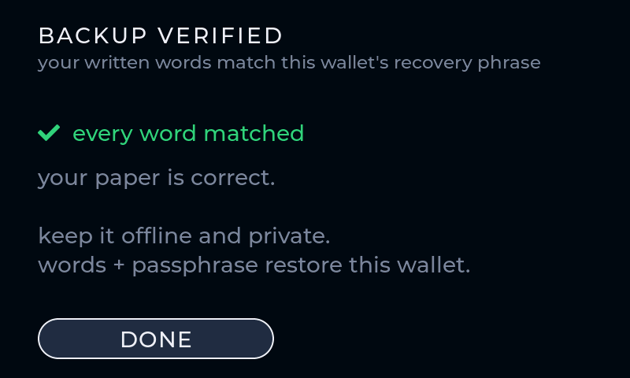
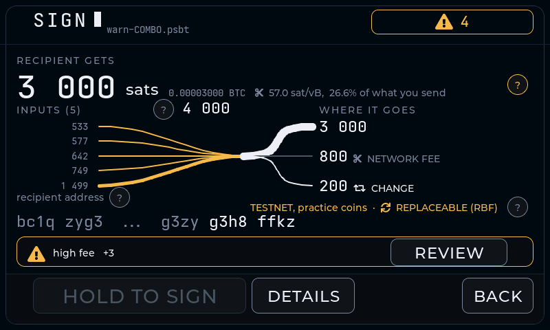
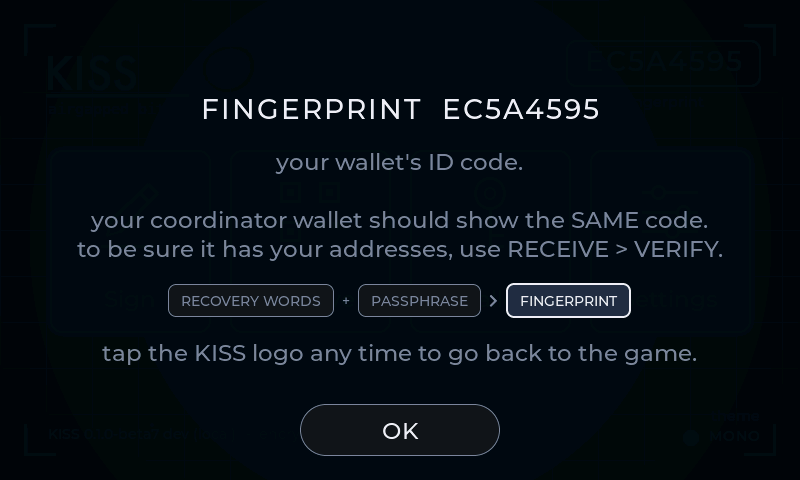

<div align="center">

# KISS Wallet 💋

**An airgapped single-sig Bitcoin signer hidden behind a fruit-slash arcade game.**

  

<table>
<tr>
<td align="center"></td>
<td align="center"></td>
</tr>
<tr>
<td align="center"><sub><b>What everyone sees</b> — a real, playable game</sub></td>
<td align="center"><sub><b>What only you see</b> — gesture + passphrase</sub></td>
</tr>
</table>

<sub>All screenshots on this page are rendered by the desktop simulator from the real firmware sources.</sub>

*Keep it simple. Make it clear. Make it safe.*

</div>

Inspired by [Bowser](https://github.com/arcbtc/bowser-bitcoin-hardware-wallet),
a Bitcoin signer hidden under a Tetris game.

> [!CAUTION]
> **`0.1.0-beta4` is experimental. Do not trust it with meaningful funds.**

- **Recovery words + passphrase derive your wallet.** The ordered words are
  commonly called a "seed phrase"; technically, BIP39 processes the mnemonic
  sentence and passphrase into a binary seed. The passphrase is typed fresh
  every time and never stored. An empty passphrase uses the base wallet; any
  non-empty entry changes the derived wallet. Every entry is valid, so there is
  no "wrong passphrase" error. A strong passphrase can protect funds if the
  words are exposed, but an attacker can test passphrase guesses offline.
- **Airgapped by hardware:** transactions move by animated QR (BC-UR) or SD
  card. The ESP32-P4 running KISS has no radio; the board's ESP32-C6 radio
  chip is held in reset from the first instruction, every boot, and no
  wireless stack is compiled in — the release build fails if any radio or
  networking code links.
- **Online wallet compatible:** pairs with desktop apps that read descriptors
  (Sparrow, Specter, Nunchuk) and mobile apps that read a zpub (BlueWallet,
  Nunchuk, Ibis). The coordinator app watches balances, builds transactions and
  broadcasts — it cannot sign or authorize anything by itself. KISS stays
  offline, verifies the PSBT, and signs only what it can fully show.
- **Shows everything, warns in plain words, teaches as you go:** before you sign,
  every amount, the fee, and each change output are re-derived and shown on the
  device. It flags an unusually high fee, a tiny "dust" coin or change that hurts
  your privacy, and a reused receive address — each as a soft caution you
  acknowledge, never a silent surprise. A **?** on any unfamiliar term opens a
  short plain-words card, with a small diagram where a picture helps.

Runs on the Guition **JC4880P443C** dev board — ESP32-P4, 480×800 MIPI-DSI
touch panel, camera, SD card slot. No soldering.

## Install (beta)

For this beta, use the signed artifacts attached to the
[latest GitHub Release](https://github.com/kkdao/kiss-wallet/releases/latest).
The browser installer comes later, once GitHub Pages is live (Chrome / Edge /
Brave on desktop only — Safari and Firefox cannot flash over Web Serial).

**1. Download** these release assets into one folder:

- `kiss-wallet-0.1.0-beta4.bin`
- `SHA256SUMS`
- `SHA256SUMS.asc`
- `kiss_wallet_pgp.asc`

**2. Verify** before flashing:

```sh
gpg --import kiss_wallet_pgp.asc
gpg --verify SHA256SUMS.asc SHA256SUMS      # expect this fingerprint:
# 166A CBF3 7786 FCEA A694  96DE 886F 1BFE B84E F1C0
shasum -a 256 --ignore-missing -c SHA256SUMS   # macOS (Linux: sha256sum)
```

> [!TIP]
> Cross-check the fingerprint from more than one place — it is only as
> trustworthy as this README.

**3. Flash** (macOS / Linux / WSL / Git Bash — on plain Windows, put the
`esptool` command on one line without the `\` continuations):

```sh
pip install esptool   # or: pipx install esptool / uvx esptool

# port: /dev/cu.usbmodem* (macOS) | /dev/ttyACM* (Linux) | COMx (Windows)
esptool --chip esp32p4 -p <port> -b 460800 \
  --before default-reset --after no-reset write-flash \
  --flash-mode dio --flash-size 16MB --flash-freq 80m \
  0 kiss-wallet-0.1.0-beta4.bin
```

> [!IMPORTANT]
> After flashing: **unplug the board, wait ~3 seconds, plug it back in.** The
> board only starts new firmware from a real power-on.

Stuck on any step? The [docs](docs/) walk through each one per OS.

## First boot

The game is what boots. A secret gesture on the game menu opens the signer
(covered in the docs) — then setup takes two minutes:

<table>
<tr>
<td align="center"></td>
<td align="center"></td>
</tr>
<tr>
<td align="center"><sub>Create a new wallet, or restore from words</sub></td>
<td align="center"><sub>Write the 12 recovery words on paper; the same passphrase is also required</sub></td>
</tr>
<tr>
<td align="center"></td>
<td align="center"></td>
</tr>
<tr>
<td align="center"><sub>A short quiz proves you really wrote them down</sub></td>
<td align="center"><sub>Pick a passphrase — typed at every unlock, never stored</sub></td>
</tr>
</table>

> [!TIP]
> **Before you fund it, verify your backup.** WALLET → BACKUP WORDS → **VERIFY
> MY COPY** has you type your words from paper; the device confirms they rebuild
> this exact wallet and never shows the stored words. A wrong or missing word is
> reported by position ("word #N"). Bad backups lose more coins than bad signers
> do — it's worth the two minutes.

<div align="center">
<br>
<sub><b>Verify my copy</b> — type the paper words; the device confirms without revealing them</sub>
</div>

## Day to day

Pair with an online coordinator app: **WALLET → PAIR COORDINATOR**, then pick
DESKTOP (descriptor, for Sparrow) or MOBILE (zpub, for BlueWallet). The app
watches the chain and builds transactions; KISS only ever sees the PSBT, shows
you exactly what it spends, and signs. Keys never leave the device.

First time? Do a practice run — send a tiny amount in and back out — before
trusting the setup with real coins.

> [!NOTE]
> BlueWallet labels the imported wallet **"watch-only." That is expected** — it
> holds only your public key, so it can show balances, hand out receive
> addresses, build transactions and broadcast signed ones. It cannot sign or
> authorize a spend by itself; every spend is reviewed and signed on KISS.
> Quick pairing check: import the zpub, then compare the first receive address
> in BlueWallet against **Receive → VERIFY** on the device before using it.

<table>
<tr>
<td align="center"></td>
<td align="center"></td>
</tr>
<tr>
<td align="center"><sub><b>Receive</b> — verify the address on the device, not the computer</sub></td>
<td align="center"><sub><b>Sign</b> — every amount and change output shown first; an unusually high fee turns amber before you can sign</sub></td>
</tr>
<tr>
<td align="center"></td>
<td align="center"></td>
</tr>
<tr>
<td align="center"><sub><b>Hand back by QR</b> — scan the loop with your coordinator; <b>EASY SCAN</b> slows it and enlarges the dots if your phone struggles</sub></td>
<td align="center"><sub><b>…or by SD card</b> — the device never touched the network</sub></td>
</tr>
</table>

### Warnings and learning, on the device

Before every signature KISS re-derives the whole transaction on its own screen
and calls out anything worth a second look — always a caution you acknowledge,
never a silent block:

- **High fee** — the fee turns amber if it's a large share of what you send (the
  rule Krux uses), or an outsized sat/vB rate.
- **Dust / privacy** — spending a tiny coin, or leaving tiny change, is flagged:
  both can be used to link and track your addresses. Change below the network
  dust limit is flagged louder.
- **Reused address** — Receive hands you a fresh address and warns if you page
  back to one already used; reusing an address links your payments together.

When any of these fire, the sign button is gated behind an **I UNDERSTAND** tap,
and a **?** opens a plain-words card explaining exactly why. Tap **?** anywhere a
term is unfamiliar (RBF, fingerprint, coordinator, dust), or tap the fingerprint
on the home screen, to learn as you go.

<table>
<tr>
<td align="center"></td>
<td align="center"></td>
</tr>
<tr>
<td align="center"><sub><b>Cautions stack</b> — a short summary, a <b>?</b> for why, and <b>I UNDERSTAND</b> before you can sign</sub></td>
<td align="center"><sub><b>Learn as you go</b> — plain-words cards, with a small diagram where a picture helps</sub></td>
</tr>
</table>

## Docs

The full guides live in [`docs/`](docs/) for now and move to GitHub Pages once
the repo is public. They cover:

- **Verify the release** — GPG + SHA256 walkthrough, including Windows
- **Flash with esptool** — command-line install on macOS / Linux / Windows
- **Build from source** — reproducible Docker builds, hashes match CI
- **Flash encryption** — the one-way final-board build and what it costs
- **First boot** — the unlock gesture, passphrase model, pairing Sparrow
- **Simulator & tests** — try the UI and run the test suite, no hardware

What changed between releases is in the [changelog](CHANGELOG.md).

## Build from source

Only requirement is Docker; builds are reproducible, so your hashes must match
[CI](.github/workflows/reproducible-build.yml)'s:

```sh
tools/build_release.sh     # verified release build -> build-release/
```

## Reproducible builds

Do not trust a firmware download just because it is attached to a release.
KISS release builds are rebuilt by GitHub Actions, and the same commit should
produce the same SHA256 hashes locally.

```sh
tools/build_release.sh
shasum -a 256 \
  build-release/guition_kiss_bringup.bin \
  build-release/bootloader/bootloader.bin \
  build-release/partition_table/partition-table.bin
```

Compare those hashes with the matching GitHub Actions run. For final funded
boards, use `tools/build_encrypted_release.sh` and compare the encrypted-release
hashes instead.

## Flash encryption (final-board build)

`tools/build_encrypted_release.sh` builds the hardened profile: flash
encryption in release mode plus NVS encryption, so the stored seed cannot be
read out of the chip.

> [!WARNING]
> The first boot **burns eFuses — no undo** — and the board can **never be
> reflashed** after it. Fresh final-signer board only. Read the
> [docs](docs/guide.html) twice before touching it.

## License

KISS Wallet's original source code and documentation are licensed under the
[Apache License 2.0](LICENSE). Vendored third-party components and assets keep
their own licenses: [libwally-core](components/libwally-core) (MIT), Espressif
components and ESP-IDF (Apache-2.0), LVGL (MIT), the fonts (SIL OFL 1.1), and the
[Twemoji](https://github.com/twitter/twemoji) kiss mark and language flags
(CC-BY 4.0) under `assets/`. The full component-by-component list is in
[THIRD_PARTY_NOTICES.md](THIRD_PARTY_NOTICES.md).

One open item before a public binary release: the decoy game's fruit art
(`assets/emoji/`) has **provenance not yet verified** (its style matches
Microsoft Fluent Emoji, MIT, but this is unconfirmed). It must be verified or
replaced with a CC0/CC-BY/MIT set before release — see [`assets/README.md`](assets/README.md).

**Use at your own risk. This is experimental firmware; do not trust it with
meaningful funds.**
