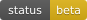
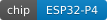
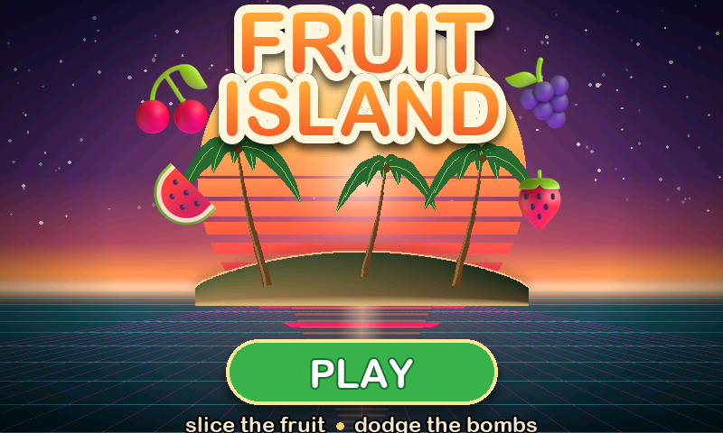

<div align="center">

# KISS Wallet

**An airgapped single-sig Bitcoin signer hidden behind a fruit-slash arcade game.**

  

<table>
<tr>
<td align="center"></td>
<td align="center"></td>
</tr>
<tr>
<td align="center"><sub><b>What everyone sees</b> — a real, playable game</sub></td>
<td align="center"><sub><b>What only you see</b> — gesture + passphrase</sub></td>
</tr>
</table>

<sub>Both frames rendered by the desktop simulator from the real firmware sources.</sub>

*Keep it small. Make it safe. Make it clear.*

</div>

Inspired by [Bowser](https://github.com/arcbtc/bowser-bitcoin-hardware-wallet),
the only other decoy hardware wallet — a signer hidden under a Tetris game.

> [!CAUTION]
> **`0.8.0-beta1` is experimental. Do not trust it with meaningful funds.**

- **Seed + passphrase = your wallet.** The BIP39 passphrase is typed fresh every
  time, never stored, and there is no "wrong passphrase" error by design — a
  different passphrase simply opens a different wallet (deniability built in).
- **Airgapped by hardware:** transactions move by animated QR (BC-UR) or SD
  card. KISS has no networking feature and no wireless path — the ESP32-P4 has
  no WiFi/Bluetooth radio to accidentally leave on.
- **Online wallet compatible:** exports descriptors for Sparrow and friends.
  The watch-only wallet builds and broadcasts; KISS stays offline, verifies the
  PSBT, and signs only what it can fully show.

Runs on the Guition **JC4880P443C** dev board — ESP32-P4, 480×800 MIPI-DSI
touch panel, camera, SD card slot. No soldering.

## Install

Flash from the browser with the web installer — **Chrome, Brave, or Edge** on
any desktop OS (Safari and Firefox have no Web Serial). While this repo is
private, the installer and docs site are served locally:

```sh
git clone https://github.com/kkdao/kiss-wallet.git && cd kiss-wallet
python3 -m http.server 8321 -d docs
# open http://localhost:8321 in Chrome / Brave / Edge
```

> [!IMPORTANT]
> After flashing: **unplug the board, wait ~3 seconds, plug it back in.** The
> board only starts new firmware from a real power-on.

Verify the release before flashing. Artifacts live in
[`docs/installer/`](docs/installer/):

```sh
cd docs/installer
gpg --import kiss_wallet_pgp.asc
gpg --verify SHA256SUMS.asc SHA256SUMS      # expect this fingerprint:
# 166A CBF3 7786 FCEA A694  96DE 886F 1BFE B84E F1C0
shasum -a 256 --ignore-missing -c SHA256SUMS   # macOS (Linux: sha256sum)
```

> [!TIP]
> Cross-check the fingerprint from more than one place — it is only as
> trustworthy as this README.

## Docs

The full guides live on the docs site — the same `http.server` command above
serves it at `http://localhost:8321/guide.html` (GitHub Pages once the repo is
public). It covers:

- **Verify the release** — GPG + SHA256 walkthrough, including Windows
- **Flash with esptool** — command-line install on macOS / Linux / Windows
- **Build from source** — reproducible Docker builds, hashes match CI
- **Flash encryption** — the one-way final-board build and what it costs
- **First boot** — the unlock gesture, passphrase model, pairing Sparrow
- **Simulator & tests** — try the UI and run the test suite, no hardware

## Build from source

Only requirement is Docker; builds are reproducible, so your hashes must match
[CI](.github/workflows/reproducible-build.yml)'s:

```sh
tools/build_release.sh     # verified release build -> build-release/
```

## Flash encryption (final-board build)

`tools/build_encrypted_release.sh` builds the hardened profile: flash
encryption in release mode plus NVS encryption, so the stored seed cannot be
read out of the chip.

> [!WARNING]
> The first boot **burns eFuses — no undo** — and the board can **never be
> reflashed** after it. Fresh final-signer board only. Read the
> [docs](docs/guide.html) twice before touching it.

## Licensing

Project license: TBD. Vendored third-party components keep their own licenses:
[libwally-core](components/libwally-core) (MIT/BSD), Espressif components
(Apache-2.0), CC0 game art and the [Twemoji](https://github.com/twitter/twemoji)
kiss mark (CC-BY 4.0) under `assets/`. No unlicensed or watermarked assets are
used anywhere.

**Use at your own risk. This is experimental firmware; do not trust it with
meaningful funds.**
