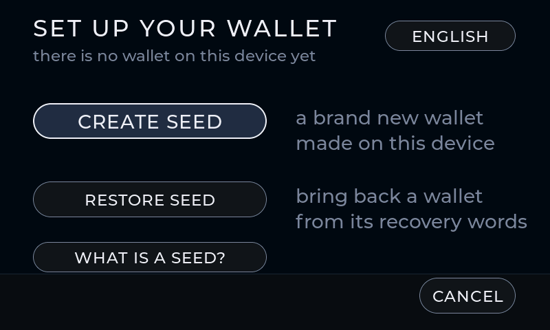
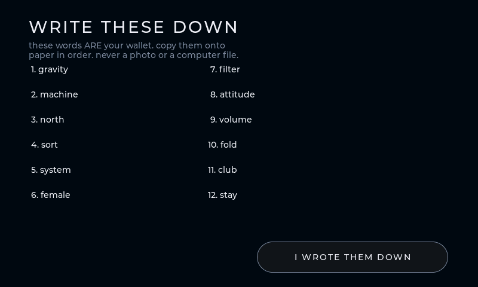
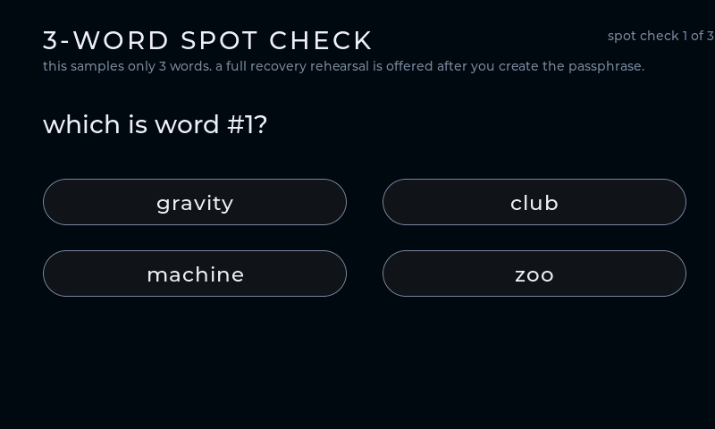
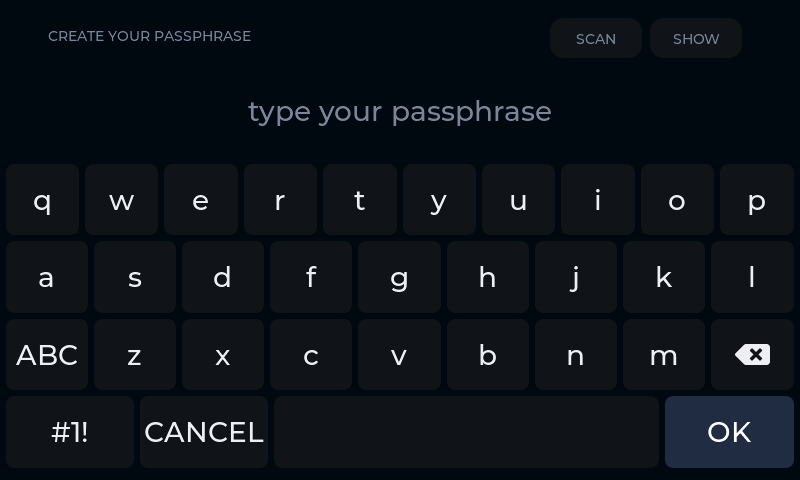
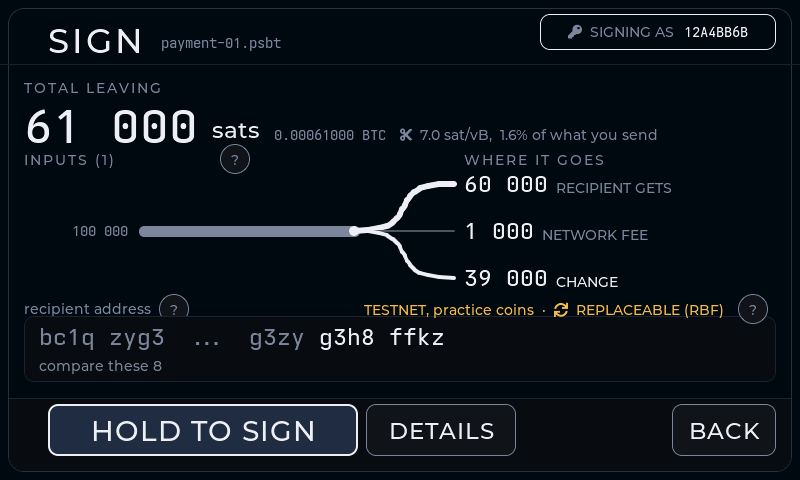

<div align="center">

# KISS Wallet 💋

**An airgapped single-sig Bitcoin signer hidden behind a fruit-slash arcade game.**

  

<table>
<tr>
<td align="center"></td>
<td align="center"></td>
</tr>
<tr>
<td align="center"><sub><b>What everyone sees</b> — a real, playable game</sub></td>
<td align="center"><sub><b>What only you see</b> — gesture + passphrase</sub></td>
</tr>
</table>

<sub>All screenshots on this page are rendered by the desktop simulator from the real firmware sources.</sub>

*Keep it small. Make it safe. Make it clear.*

</div>

Inspired by [Bowser](https://github.com/arcbtc/bowser-bitcoin-hardware-wallet),
a Bitcoin signer hidden under a Tetris game.

> [!CAUTION]
> **`0.1.0-beta1` is experimental. Do not trust it with meaningful funds.**

- **Seed + passphrase = your wallet.** The BIP39 passphrase is typed fresh every
  time, never stored, and there is no "wrong passphrase" error by design — a
  different passphrase simply opens a different wallet (deniability built in).
- **Airgapped by hardware:** transactions move by animated QR (BC-UR) or SD
  card. The ESP32-P4 running KISS has no radio; the board's ESP32-C6 radio
  chip is held in reset from the first instruction, every boot, and no
  wireless stack is compiled in — the release build fails if any radio or
  networking code links.
- **Online wallet compatible:** exports descriptors for Sparrow and friends.
  The online coordinator app builds and broadcasts; KISS stays offline, verifies
  the PSBT, and signs only what it can fully show.

Runs on the Guition **JC4880P443C** dev board — ESP32-P4, 480×800 MIPI-DSI
touch panel, camera, SD card slot. No soldering.

## Install (beta)

For this beta, use the signed artifacts attached to the
[latest GitHub Release](https://github.com/kkdao/kiss-wallet/releases/latest).
The browser installer comes later, once GitHub Pages is live (Chrome / Edge /
Brave on desktop only — Safari and Firefox cannot flash over Web Serial).

**1. Download** these release assets into one folder:

- `kiss-wallet-0.1.0-beta1.bin`
- `SHA256SUMS`
- `SHA256SUMS.asc`
- `kiss_wallet_pgp.asc`

**2. Verify** before flashing:

```sh
gpg --import kiss_wallet_pgp.asc
gpg --verify SHA256SUMS.asc SHA256SUMS      # expect this fingerprint:
# 166A CBF3 7786 FCEA A694  96DE 886F 1BFE B84E F1C0
shasum -a 256 --ignore-missing -c SHA256SUMS   # macOS (Linux: sha256sum)
```

> [!TIP]
> Cross-check the fingerprint from more than one place — it is only as
> trustworthy as this README.

**3. Flash** (macOS / Linux / WSL / Git Bash — on plain Windows, put the
`esptool` command on one line without the `\` continuations):

```sh
pip install esptool   # or: pipx install esptool / uvx esptool

# port: /dev/cu.usbmodem* (macOS) | /dev/ttyACM* (Linux) | COMx (Windows)
esptool --chip esp32p4 -p <port> -b 460800 \
  --before default-reset --after no-reset write-flash \
  --flash-mode dio --flash-size 16MB --flash-freq 80m \
  0 kiss-wallet-0.1.0-beta1.bin
```

> [!IMPORTANT]
> After flashing: **unplug the board, wait ~3 seconds, plug it back in.** The
> board only starts new firmware from a real power-on.

Stuck on any step? The [docs](docs/) walk through each one per OS.

## First boot

The game is what boots. A secret gesture on the game menu opens the signer
(covered in the docs) — then setup takes two minutes:

<table>
<tr>
<td align="center"></td>
<td align="center"></td>
</tr>
<tr>
<td align="center"><sub>Create a new wallet, or restore from words</sub></td>
<td align="center"><sub>Write the 12 words on paper — words + passphrase are the wallet</sub></td>
</tr>
<tr>
<td align="center"></td>
<td align="center"></td>
</tr>
<tr>
<td align="center"><sub>A short quiz proves you really wrote them down</sub></td>
<td align="center"><sub>Pick a passphrase — typed at every unlock, never stored</sub></td>
</tr>
</table>

## Day to day

Pair the exported descriptor with an online coordinator app (Sparrow Wallet).
It watches the chain and builds transactions; KISS only ever sees the PSBT,
shows you exactly what it spends, and signs. Keys never leave the device.

<table>
<tr>
<td align="center"></td>
<td align="center"></td>
</tr>
<tr>
<td align="center"><sub><b>Receive</b> — verify the address on the device, not the computer</sub></td>
<td align="center"><sub><b>Sign</b> — every amount, fee, and change output shown first</sub></td>
</tr>
<tr>
<td align="center"></td>
<td align="center"></td>
</tr>
<tr>
<td align="center"><sub><b>Hand back by QR</b> — scan the loop with your coordinator</sub></td>
<td align="center"><sub><b>…or by SD card</b> — the device never touched the network</sub></td>
</tr>
</table>

## Docs

The full guides live in [`docs/`](docs/) for now and move to GitHub Pages once
the repo is public. They cover:

- **Verify the release** — GPG + SHA256 walkthrough, including Windows
- **Flash with esptool** — command-line install on macOS / Linux / Windows
- **Build from source** — reproducible Docker builds, hashes match CI
- **Flash encryption** — the one-way final-board build and what it costs
- **First boot** — the unlock gesture, passphrase model, pairing Sparrow
- **Simulator & tests** — try the UI and run the test suite, no hardware

## Build from source

Only requirement is Docker; builds are reproducible, so your hashes must match
[CI](.github/workflows/reproducible-build.yml)'s:

```sh
tools/build_release.sh     # verified release build -> build-release/
```

## Flash encryption (final-board build)

`tools/build_encrypted_release.sh` builds the hardened profile: flash
encryption in release mode plus NVS encryption, so the stored seed cannot be
read out of the chip.

> [!WARNING]
> The first boot **burns eFuses — no undo** — and the board can **never be
> reflashed** after it. Fresh final-signer board only. Read the
> [docs](docs/guide.html) twice before touching it.

## Licensing

Project license: TBD. Vendored third-party components keep their own licenses:
[libwally-core](components/libwally-core) (MIT/BSD), Espressif components
(Apache-2.0), CC0 game art and the [Twemoji](https://github.com/twitter/twemoji)
kiss mark (CC-BY 4.0) under `assets/`. No unlicensed or watermarked assets are
used anywhere.

**Use at your own risk. This is experimental firmware; do not trust it with
meaningful funds.**
