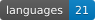
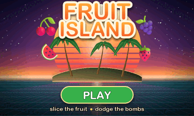

<div align="center">

# KISS Signer 💋

**An airgapped single-sig Bitcoin signer hidden behind a fruit slashing arcade game.**

      



**Draw KISS anywhere on the menu.** The device shows nothing while you draw. The strokes are traced onto this picture so you can see where they go.

<table>
<tr>
<td align="center"></td>
<td align="center"></td>
</tr>
<tr>
<td align="center">What everyone sees: a real, playable game</td>
<td align="center">What only you see: gesture, then passphrase</td>
</tr>
</table>

*Keep it simple. Make it clear. Make it safe.*

[Simulator](https://diybitcoin.github.io/kiss-signer/sim/) &nbsp;·&nbsp;
[Docs](https://diybitcoin.github.io/kiss-signer/guide.html) &nbsp;·&nbsp;
[Walkthrough](docs/walkthrough.md) &nbsp;·&nbsp;
[Changelog](CHANGELOG.md) &nbsp;·&nbsp;
[Roadmap](ROADMAP.md) &nbsp;·&nbsp;
[Security](SECURITY.md) &nbsp;·&nbsp;
[Telegram](https://t.me/KISS_signer)

</div>

> [!CAUTION]
> **Experimental beta firmware. Do not trust it with meaningful funds.**

## What it is

- **Your seed words plus a passphrase make your keys.** The passphrase is typed
  fresh every time and never stored. Every passphrase is valid, so there is no
  wrong one: a different passphrase quietly opens different keys.
- **Airgapped by hardware.** Transactions move by animated QR or SD card. The
  radio chip is held in reset from the first instruction of every boot, and the
  release build fails if any networking code links into it.
- **Works with coordinators that do both halves.** Import a descriptor or a zpub
  as watch-only, and pass transactions back by animated QR or on a microSD card.
  Reading a zpub is not enough on its own. Sparrow Wallet on desktop and
  BlueWallet on mobile are the two the pairing screen has exports for; ask in
  [Telegram](https://t.me/KISS_signer) about any other. The coordinator watches
  balances and builds transactions. It cannot sign.
- **Shows you everything before you sign.** Every amount, the fee and the change
  are worked out again on the device. A **?** on any unfamiliar word opens a
  plain words card.

Runs on the Guition **JC4880P443C** dev board: ESP32-P4, 480×800 touch panel,
camera, SD card slot. No soldering.

Inspired by [Bowser](https://github.com/arcbtc/bowser-bitcoin-hardware-wallet),
a Bitcoin signer hidden under a Tetris game.

## Install

Everything you need is attached to the
[latest release](https://github.com/DIYbitcoin/kiss-signer/releases/latest), and
[the install page](https://diybitcoin.github.io/kiss-signer/) will flash it from your
browser. To do it by hand, download the firmware, the hashes, the signature and
the public key into one folder.

**Verify first.**

```sh
gpg --import kiss_signer_pgp.asc
gpg --verify SHA256SUMS.asc SHA256SUMS      # expect this fingerprint:
# 166A CBF3 7786 FCEA A694  96DE 886F 1BFE B84E F1C0
shasum -a 256 --ignore-missing -c SHA256SUMS   # macOS (Linux: sha256sum)
```

Cross-check that fingerprint somewhere other than this page. It is only as
trustworthy as the page you read it on.

**Then flash.**

```sh
pip install esptool
# port: /dev/cu.usbmodem* (macOS) | /dev/ttyACM* (Linux) | COMx (Windows)
esptool --chip esp32p4 -p <port> -b 460800 \
  --before default-reset --after no-reset write-flash \
  --flash-mode dio --flash-size 16MB --flash-freq 80m \
  0 kiss-signer-VERSION.bin
```

> [!WARNING]
> This writes the whole chip, **including the area that holds your keys**. Have
> your seed words on paper and your passphrase in hand before flashing a device
> that already holds keys.

> [!IMPORTANT]
> Afterwards: **unplug, wait about 3 seconds, plug back in.** The device only
> starts new firmware from a real power-on.

**No internet where you flash?** Every release carries a 6 MB offline zip: the
install page, the firmware and the signed hashes in one download. Verify its
signature, move it across, unzip, run the serve script inside.

**No computer at all?** A running signer takes its next firmware off the SD
card. Copy the `-update.bin` to a card, then SETTINGS > FIRMWARE. The device
checks both signatures itself before anything becomes bootable.

## First boot

The game is what boots. A secret gesture on the menu opens the signer, then
setup takes two minutes: create or restore keys, write the twelve seed
words on paper, prove you wrote them, choose a passphrase.

<table>
<tr>
<td align="center"></td>
<td align="center"></td>
</tr>
<tr>
<td align="center">Write the twelve seed words down. The passphrase is needed too.</td>
<td align="center">Type them back and the device confirms, without showing them</td>
</tr>
</table>

> [!TIP]
> **Check your backup before you fund it**, under KEYS > BACKUP > SEED WORDS.
> Bad backups lose more coins than bad signers do. Write the fingerprint from
> the home screen on the same paper: a mistyped passphrase never errors, it
> silently opens different, empty keys, and that code is how you notice.

## Day to day

Pair with a coordinator under **KEYS > PAIR COORDINATOR**. Two machines, and
neither trusts the other.

| | |
| --- | --- |
| **The coordinator** | watches the chain, hands out addresses, builds the transaction, broadcasts the signed one |
| **KISS** | holds the keys, shows you what the transaction really spends, signs |

<table>
<tr>
<td align="center"></td>
<td align="center"></td>
</tr>
<tr>
<td align="center">Verify the address on the device, not on the computer</td>
<td align="center">Every amount and change output shown before you can sign</td>
</tr>
</table>

Rehearse on testnet first, under **SETTINGS > SIGNER > NETWORK**. The coins are
free and the screens are the ones you will use for real.

Before every signature the device re-derives the whole transaction and calls out
a high fee, a dust amount, or change that hurts your privacy. Each one is a
caution you acknowledge behind an **I UNDERSTAND** tap, never a silent block.
Address reuse is different: the device cannot see the chain, so RECEIVE simply
hands you a fresh address each time. The SILENT tab holds one address you can
publish forever instead.

## Docs

The [guide](https://diybitcoin.github.io/kiss-signer/guide.html) covers verifying a release, flashing on each
operating system, flashing with no internet, first boot, pairing Sparrow, and
building from source. The [walkthrough](docs/walkthrough.md) is the short
version: the five things to do before the signer holds anything you care about.

Every screenshot here and in the docs is a frame the simulator rendered from the
current firmware, not a photograph.

## Build it yourself

Docker is the only requirement, and the builds are reproducible, so your hashes
must match [CI](.github/workflows/reproducible-build.yml)'s. Do not trust a
firmware download just because it is attached to a release.

```sh
tools/build_release.sh
shasum -a 256 build-release/guition_kiss_bringup.bin
```

For a device that will hold real coins, `tools/build_encrypted_release.sh`
builds the hardened profile instead.

> [!WARNING]
> That profile's first boot **burns eFuses, with no undo**, and the device can
> **never be reflashed over USB** afterwards. Signed SD updates still work and
> become the only way in. Fresh device only.

## License

Original source and documentation are [MIT](LICENSE). Vendored components keep
their own licenses: libwally-core (MIT), ESP-IDF and Espressif components
(Apache-2.0), LVGL (MIT), the fonts (SIL OFL 1.1), the Twemoji kiss mark and
flags (CC-BY 4.0), and the game's fruit art (Microsoft Fluent Emoji, MIT). The
full list is in [THIRD_PARTY_NOTICES.md](THIRD_PARTY_NOTICES.md).

**Use at your own risk. This is experimental firmware. Do not trust it with
meaningful funds.**
