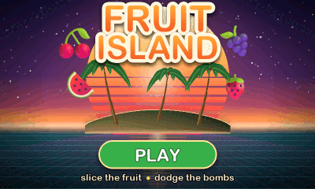
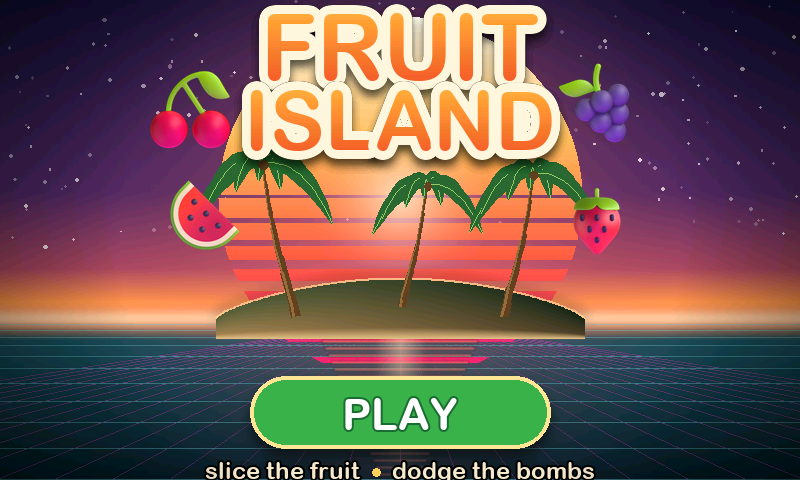
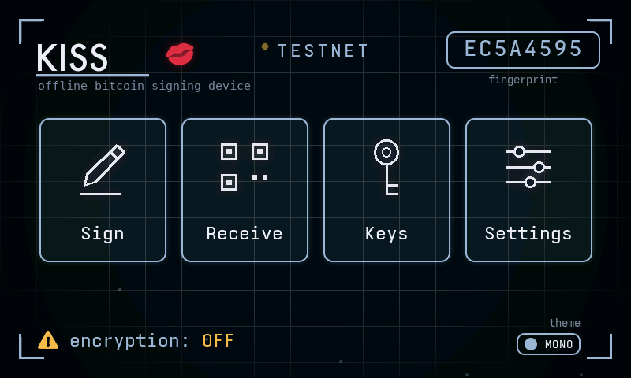
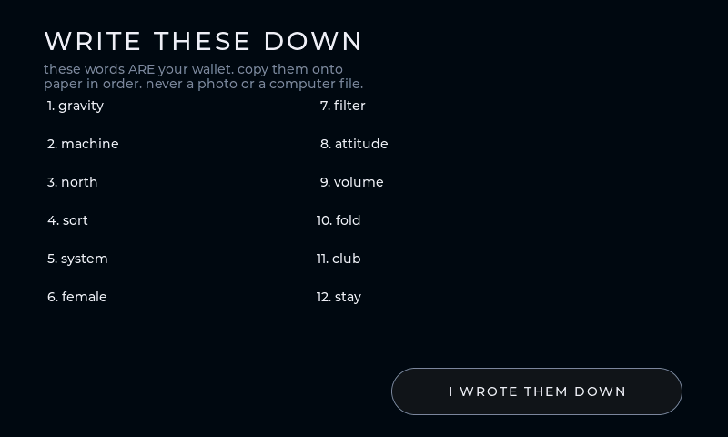
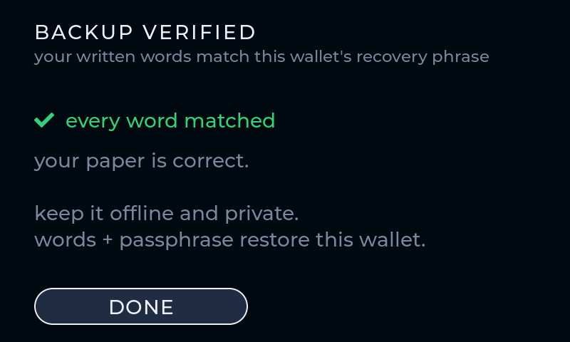
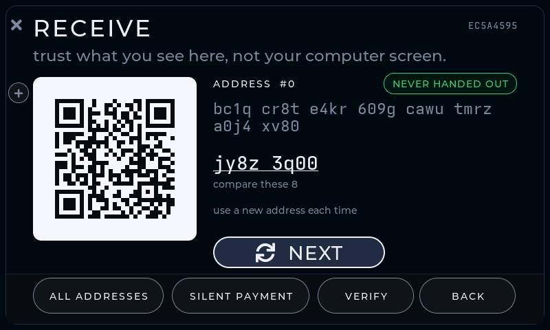
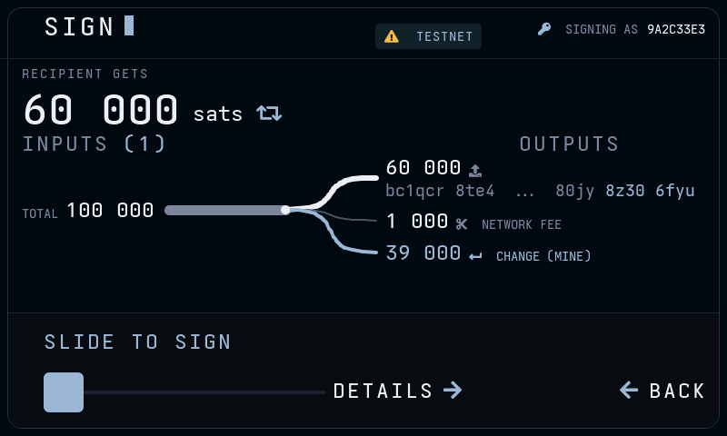

<div align="center">

# KISS Signer 💋

**An offline single-sig Bitcoin signer hidden behind a fruit slashing arcade game.**



**Draw KISS on the menu to enter.** After setup, KISS followed by your own
swipe opens your real keys, and KISS alone opens a decoy.

<table>
<tr>
<td align="center"></td>
<td align="center"></td>
</tr>
<tr>
<td align="center">What everyone sees: a playable game</td>
<td align="center">What you see after drawing KISS</td>
</tr>
</table>

*Keep it simple. Make it clear. Make it safe.*

[Simulator](https://diybitcoin.github.io/kiss-signer/sim/) &nbsp;·&nbsp;
[Docs](https://diybitcoin.github.io/kiss-signer/guide.html) &nbsp;·&nbsp;
[Walkthrough](docs/walkthrough.md) &nbsp;·&nbsp;
[Changelog](CHANGELOG.md) &nbsp;·&nbsp;
[Roadmap](docs/ROADMAP.md) &nbsp;·&nbsp;
[Security](SECURITY.md) &nbsp;·&nbsp;
[Telegram](https://t.me/KISS_signer) &nbsp;·&nbsp;
[X](https://x.com/KISS_signer)

</div>

> [!CAUTION]
> **Experimental beta firmware. Do not trust it with meaningful funds.**

## What it is

- **Your own way in.** Draw KISS, or replace it with your own drawing. After
  setup, the drawing alone opens a decoy; add your own swipe and it asks for
  your passphrase.
- **BIP39 seed plus passphrase.** 12 or 24 words. The passphrase is typed or
  scanned every session and never stored.
- **Single-sig:** native SegWit (BIP84, the default), nested SegWit (BIP49) and
  legacy (BIP44), plus Silent Payments: receive, send and spend (BIP352).
- **Offline.** PSBTs move by QR (BC-UR) or SD card. The radio chip is held in
  reset from the first instruction of every boot.
- **Works with Sparrow and BlueWallet.** Other coordinators work if they import
  a watch-only output descriptor (or a zpub) and exchange PSBTs by QR (BC-UR) or
  SD card for signing. BBQr is not supported.
- **Verifies before it signs.** Every output, the fee and the change are
  derived again on the device; change is verified, not trusted.

Runs on three ESP32-P4 boards with a touch screen, camera and microSD slot. No
soldering.

- Guition **JC4880P443C**, 4.3in, 800×480
- Waveshare **ESP32-P4-WIFI6-Touch-LCD-3.5**, 3.5in, 480×320
- Guition **JC1060P470C**, 7in, 1024×600

Boards with the newer v3.x ESP32-P4 chip are not supported yet
([roadmap](docs/ROADMAP.md)).

Inspired by [Bowser](https://github.com/arcbtc/bowser-bitcoin-hardware-wallet),
a Bitcoin signer hidden under a Tetris game.

## Install

Pick one. All three end the same way: **unplug, wait 3 seconds, plug back in.**

| | How | You need |
| --- | --- | --- |
| 🟢 **Easy** | Install page in your browser | Chrome, Brave or Edge, a USB cable |
| 🟡 **Medium** | Verify the files yourself, then flash | A terminal, `gpg`, `esptool` |
| 🔴 **Hard** | Build it from source | Docker |

> [!WARNING]
> Flashing erases the whole chip, **keys included**. Have your seed words and
> passphrase first.

### 🟢 Easy: from your browser

1. Open the [install page](https://diybitcoin.github.io/kiss-signer/).
2. Pick your board, plug it in, click **Connect and install**.
3. Unplug, wait 3 seconds, plug back in.

### 🟡 Medium: verify, then flash

1. From the [latest release](https://github.com/DIYbitcoin/kiss-signer/releases/latest),
   download your board's firmware plus `SHA256SUMS`, `SHA256SUMS.asc` and
   `kiss_signer_pgp.asc`.

   | Board | Firmware |
   | --- | --- |
   | Guition 4.3in | `kiss-signer-VERSION.bin` |
   | Waveshare 3.5in | `kiss-signer-VERSION-ws35.bin` |
   | Guition 7in | `kiss-signer-VERSION-jc1060.bin` |

2. Verify. Cross-check the fingerprint somewhere other than this page.

   ```sh
   gpg --import kiss_signer_pgp.asc
   gpg --verify SHA256SUMS.asc SHA256SUMS      # expect this fingerprint:
   # 166A CBF3 7786 FCEA A694  96DE 886F 1BFE B84E F1C0
   shasum -a 256 --ignore-missing -c SHA256SUMS   # macOS (Linux: sha256sum)
   ```

3. Flash.

   ```sh
   pip install esptool
   # port: /dev/cu.usbmodem* or /dev/cu.wchusbserial* (macOS) | /dev/ttyACM* (Linux) | COMx (Windows)
   esptool --chip esp32p4 -p <port> -b 460800 \
     --before default-reset --after no-reset write-flash \
     --flash-mode dio --flash-size 16MB --flash-freq 80m \
     0 kiss-signer-VERSION.bin
   ```

4. Unplug, wait 3 seconds, plug back in.

> [!TIP]
> **No internet on that computer?** Download `kiss-signer-VERSION-offline.zip`
> and its `.asc` instead. Verify the zip with `gpg --verify`, unzip it, run the
> serve script inside, and use the install page offline.

### 🔴 Hard: build it from source

You only need Docker. Builds are reproducible, so your hashes should match
[CI](.github/workflows/reproducible-build.yml)'s.

```sh
tools/build_release.sh                   # Guition 4.3in
KISS_BOARD=ws35 tools/build_release.sh   # Waveshare 3.5in
KISS_BOARD=jc1060 tools/build_release.sh # Guition 7in
```

Each writes its image to its own `build-release*` folder; hash it with
`shasum -a 256` and compare.

## 🔄 Updating

Copy your board's `-update.bin` from the latest release to an SD card, then
**SETTINGS > FIRMWARE**. Your keys stay.

## First boot: the one path

KISS suggests one way through. Every screen offers alternatives, and you need
none of them.

1. Draw **K I S S** on the game menu.
2. **SET UP THIS SIGNER** > **NEW SEED WORDS**.
3. Keep them in **FLASH**.
4. Make the randomness with **CAMERA AND TAPS**.
5. Write the seed words on paper, then pass the quiz.
6. Set a **passphrase** and write it on a second paper, kept apart from the
   seed words. It is never stored and it guards your real funds, so make it
   long and not guessable.
7. Set **YOUR SWIPE** when setup offers the decoy. KISS alone now opens decoy
   keys; KISS and your swipe ask for the passphrase. Put a little in the decoy.
8. Write the fingerprint from the home screen on the seed words paper.

Every day: draw KISS, draw your swipe, type your passphrase, check the
fingerprint. Your backup is the two pieces of paper.

**What goes where**

- **Seed words:** on paper, always; that paper is the backup. The signer keeps
  a working copy in **FLASH** by default, as a file on an **SD CARD**, or
  nowhere (**AMNESIC**).
- **Passphrase:** in your head and on a second paper. Never on the signer, a
  card or a QR.
- **Encrypted backup, optional:** an extra copy of the seed words (not the
  passphrase), locked with a password you choose. A QR you keep or a `.kef`
  file on an SD card, from SETTINGS > BACKUP > SEED WORDS > ENCRYPTED. Opens on
  any KISS and on Krux.
- **SD CARD storage, an alternative to FLASH:** a file only this signer can
  open, so no password and useless anywhere else. Not a backup.

With AMNESIC, the signer asks for the seed words each time: type them, scan
the encrypted backup QR, or open the `.kef` file from the card. Other
alternatives, none needed: dice, coins or a blind draw for randomness, and
restoring seed words you already have. The
[guide](https://diybitcoin.github.io/kiss-signer/guide.html#firstboot) says
what each one costs.

<table>
<tr>
<td align="center"></td>
<td align="center"></td>
</tr>
<tr>
<td align="center">Write down the seed words</td>
<td align="center">Type them back to confirm</td>
</tr>
</table>

> [!TIP]
> **Check your backup before you fund it**: SETTINGS > BACKUP > SEED WORDS. Also
> write down the fingerprint on the home screen. A mistyped passphrase gives no
> error, it just opens different, empty keys.

## Day to day

Under **KEYS > PAIR COORDINATOR**, export the watch-only output descriptor to
Sparrow (or the zpub to BlueWallet). The coordinator tracks your UTXOs, builds
the PSBT and broadcasts it; KISS verifies and signs.

<table>
<tr>
<td align="center"></td>
<td align="center"></td>
</tr>
<tr>
<td align="center">Verify the receive address on the device</td>
<td align="center">Every output, the fee and change, before you sign</td>
</tr>
</table>

Rehearse on testnet or signet first: **SETTINGS > SIGNER > NETWORK**.

Before signing, the device flags a high fee, dust attack inputs, inputs that
link your addresses, tiny change, and change your coordinator cannot see.

## Features

**🎲 Entropy you can check**
- New seeds mix four sources: the camera, the chip's hardware RNG, your taps and
  timing. No single source decides your keys.
- Or roll a die 50 times or flip a coin 128 times, and check the SHA256 on any
  computer.
- Or draw 11 words blind from a cut up BIP39 list; the device works out the
  checksum word.
- A randomness audit tests the chip's RNG on the device.

**🕵️ Duress**
- Drawing KISS alone opens decoy keys, with no passphrase. Keep a little in them
  to hand over.
- Your real keys sit behind your own extra swipe and your passphrase. You can
  also replace KISS with your own drawing.

**💾 Where your seed words live**
- **Flash, the default:** on the device, unencrypted in this beta. With a
  passphrase they open only the decoy; with none, they are your keys.
- **SD card, an alternative:** sealed to this device, so the card alone opens
  nothing. Not a backup.
- **Amnesic, an alternative:** RAM only, gone at power off. Load your seed
  words every session.

**🔑 Backups**
- Seed words and passphrase on paper, kept apart: the backup. The seed words
  are checked on the device without showing them.
- Optional extra copy: an encrypted backup as a QR or a file on the SD card, in
  Krux's KEF format, opened only with your password. Krux backups open here
  too.

**🛡️ Firmware you can trust**
- Reproducible builds and GPG signed releases.
- SD card updates are checked on the device against two signatures, ECDSA and
  post quantum SLH-DSA, and roll back by themselves if the new firmware fails
  to start.

**🌍 22 languages**, and a **?** on any Bitcoin term opens a plain words card.

**🎨 Four themes:** MONO, GREEN, CYPHERPINK and ORANGE. Tap the theme's name on
the home page to switch, or the colour swatch at the top of Settings.

## Docs

The [guide](https://diybitcoin.github.io/kiss-signer/guide.html) has the details.
The [walkthrough](docs/walkthrough.md) is the short version.

## 🔐 Security

Found a vulnerability? Email **diybitcoin@protonmail.com**. Please do not open a
public issue for anything that could put funds at risk. Details in
[SECURITY.md](SECURITY.md).

## 💬 Community

- **Telegram:** [t.me/KISS_signer](https://t.me/KISS_signer) for questions,
  ideas and help
- **X:** [@KISS_signer](https://x.com/KISS_signer) for news and releases
- **GitHub issues** for bugs that do not put funds at risk

## 🤝 Contributing

Pull requests are welcome. To keep reviews quick:

1. **One open pull request at a time.** GitHub enforces this; drafts do not
   count. When yours is merged or closed, open the next.
2. **One fix or feature per pull request**, based on the `develop` branch.
3. Read [CONTRIBUTING.md](CONTRIBUTING.md) first: building, tests, and testing
   on a real board.

New to pull requests? GitHub's
[guide](https://docs.github.com/en/pull-requests/collaborating-with-pull-requests/proposing-changes-to-your-work-with-pull-requests/creating-a-pull-request-from-a-fork)
walks you through it. Found a vulnerability? Email it instead, see Security
above.

## License

[MIT](LICENSE). Third party components keep their own licenses, listed in
[THIRD_PARTY_NOTICES.md](THIRD_PARTY_NOTICES.md).
