<!-- Generated by tools/gen_docs_shots.py. Do not edit by hand:
     the captions live in that file so they cannot drift from the
     screenshots, and every screenshot is a real simulator frame. -->

# Walkthrough

The checks to make before this wallet holds anything you care about. Every screenshot here is a frame the simulator rendered from the current firmware, so what you see is what the device draws.

## Returning from Fruit Island

The wallet has no icon and no launcher. You get back to it by drawing the letters K, I, S, S on the game menu with a fingertip. Nothing on the screen invites you to, and a wrong gesture does nothing at all.

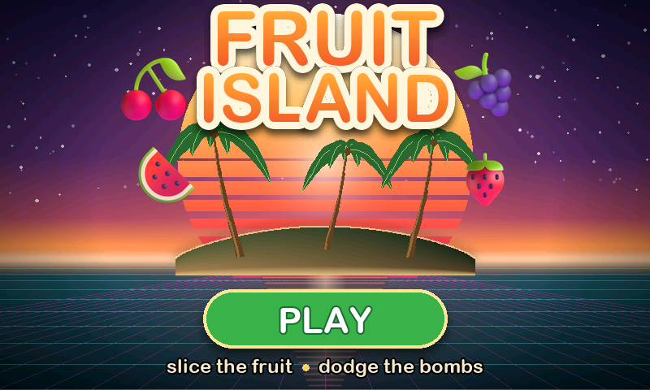

This is everything an onlooker sees: a fruit game. No wallet button, no lock icon, no hint that anything else is installed.

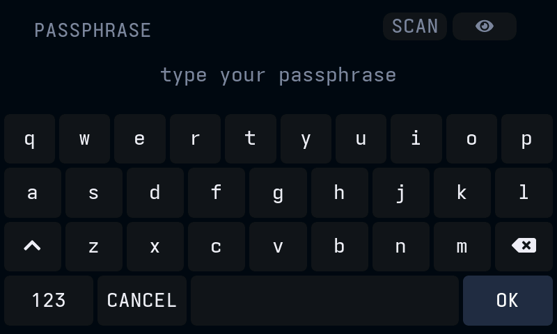

Draw K, I, S, S anywhere on the menu. On a device with no duress strokes set, that opens the passphrase login.

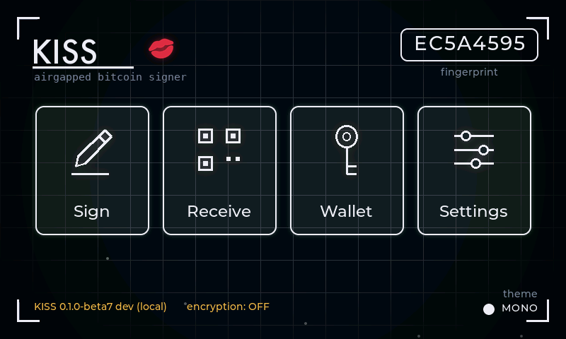

Your recovery words and your exact passphrase together make this wallet. A different passphrase silently opens a different wallet, so check the fingerprint is the one you expect.

This only works if you wrote the fingerprint down. Do it once, on the same piece of paper as your recovery words: the eight character code on this screen. Every passphrase is valid, so a typo never shows an error, it just opens a different and empty wallet. If the code here ever differs from your paper, you typed the passphrase wrong. Lock and try again.

## Choosing where the recovery words live

Storage is chosen while a wallet is created or restored, and it can be changed later from an unlocked wallet. All three modes are offered on every build; the passphrase, never stored here, is what guards the real wallet whichever mode holds the words.

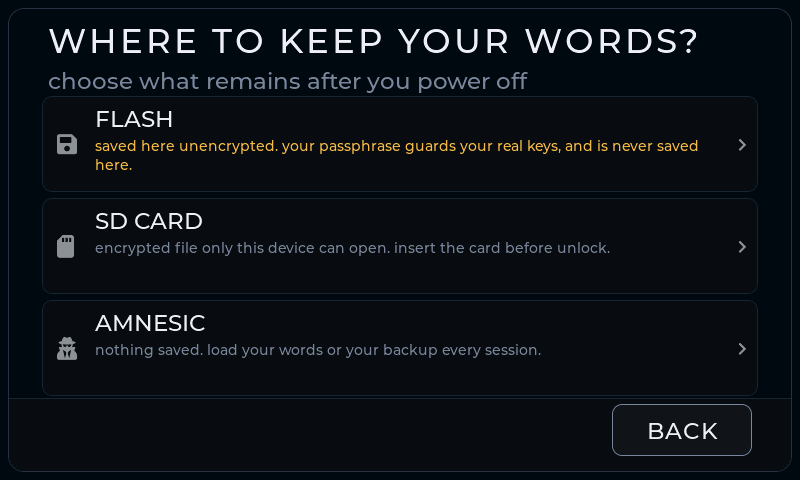

Setup asks what remains after you power off, before the recovery words are committed. FLASH keeps the words on this device (they open the decoy if it is taken); AMNESIC keeps nothing; SD CARD seals the words to a card only this signer can open.

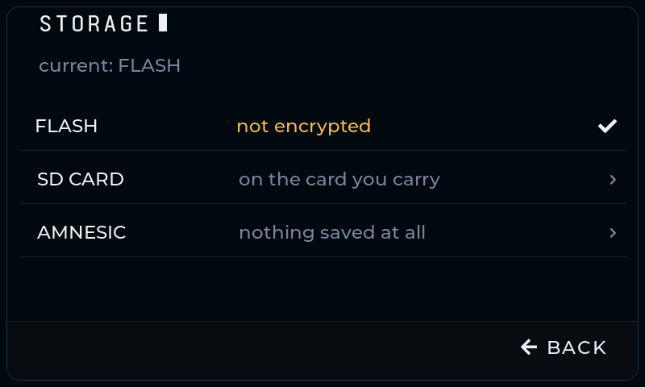

SETTINGS → STORAGE shows the current mode and the same three choices. Moving between modes requires a deliberate hold and verifies the destination before removing the source.

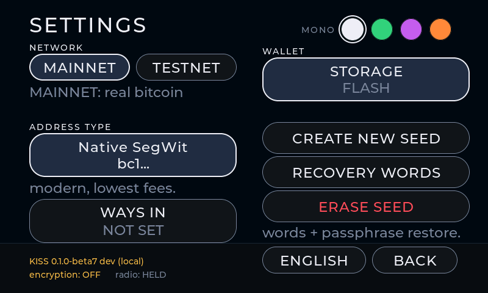

SETTINGS itself, the page both of those are reached from. Storage and address type read their current value on the row that opens them, so nothing here has to be opened to be checked.

## Two ways in: the spare wallet

A passphrase field on screen is itself a tell. It proves there is something to leave out of it, and you can never show that the passphrase you gave was the last one. So the obvious gesture opens a real, working wallet that asks for nothing, and the passphrase lives behind one extra stroke.

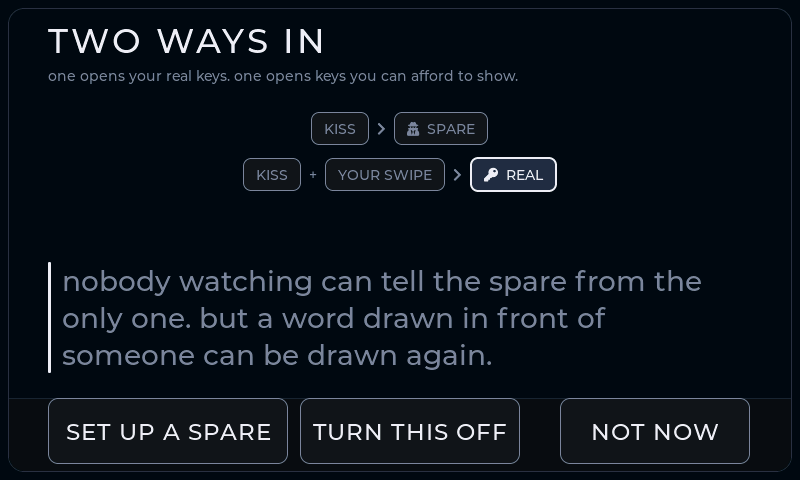

Drawing KISS on its own opens a spare wallet: the same recovery words with no passphrase. It has its own fingerprint, pairs with a coordinator and signs, because a wallet that cannot do those things is not a story anyone would believe.

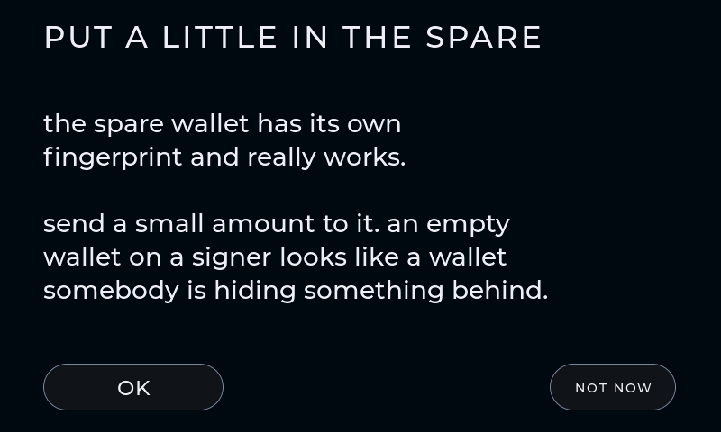

Put a small amount in it. An empty wallet on a signer looks exactly like a wallet with something hidden behind it.

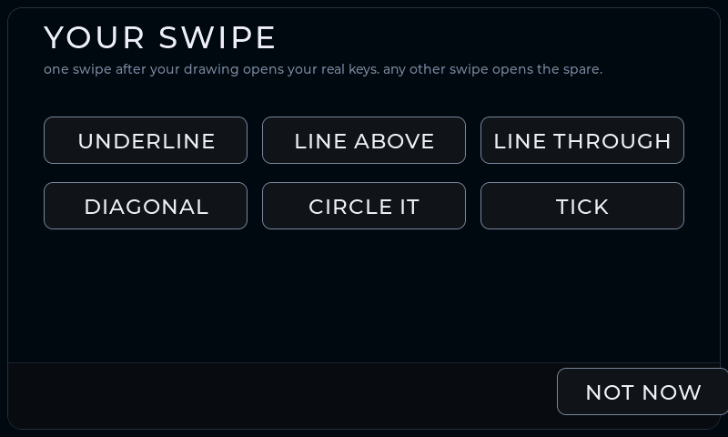

One extra stroke after the word decides which wallet opens. You choose which stroke is yours, so reading this firmware does not tell anyone what to draw.

Draw it over the printed word, twice, before anything is saved. Plain KISS keeps working forever and always opens the spare, so forgetting your stroke can never lock you out of the device.

## Pairing with Sparrow

Pairing hands Sparrow a watch-only map of the wallet so it can find your addresses and build transactions. It never hands over anything that can spend.

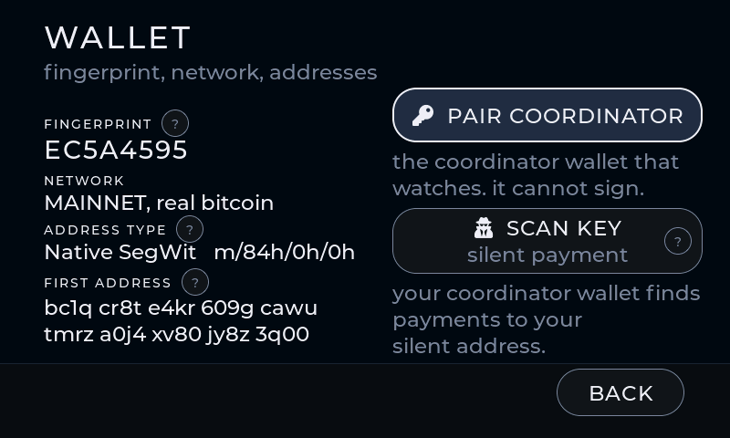

WALLET carries the facts you check against the coordinator: fingerprint, network, address type and the first address.

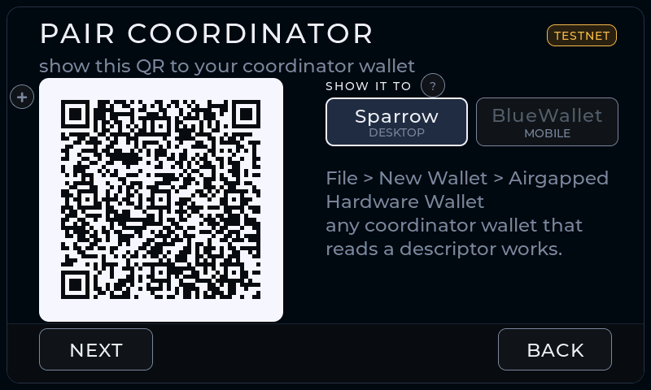

PAIR COORDINATOR with DESKTOP selected shows the descriptor Sparrow reads. Scan it with Sparrow's webcam, or export to SD. Tap the + beside any QR to enlarge it.

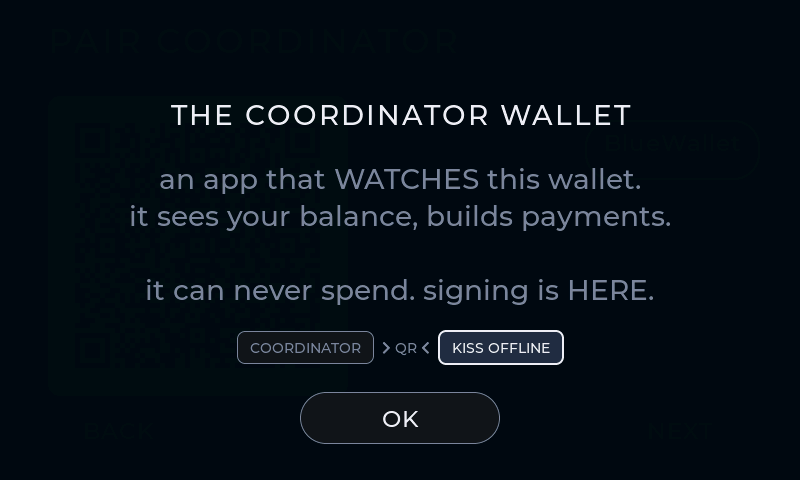

The "?" spells out what the coordinator can and cannot do with what you just handed it.

## Verifying the first receive address

Do this once, before any money moves. It is the step that catches a computer showing you an address that is not yours.

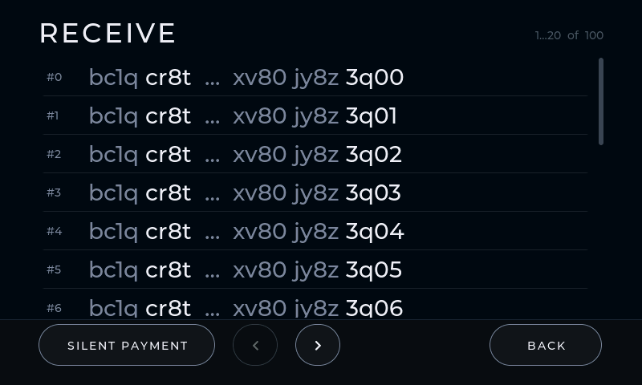

RECEIVE lists addresses KISS derived on the device. Tap any of them for its QR. Read them here, on the device, never off the computer.

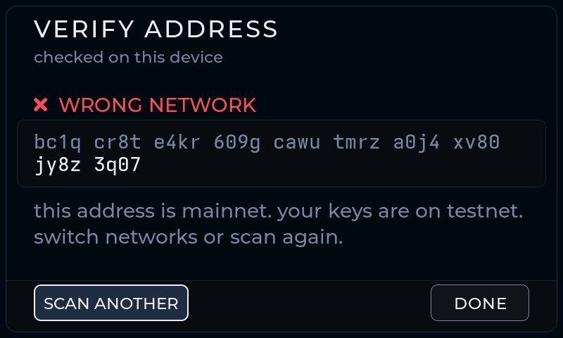

VERIFY re-derives whatever address you type in. Green means KISS found it in this wallet, independently of whatever displayed it.

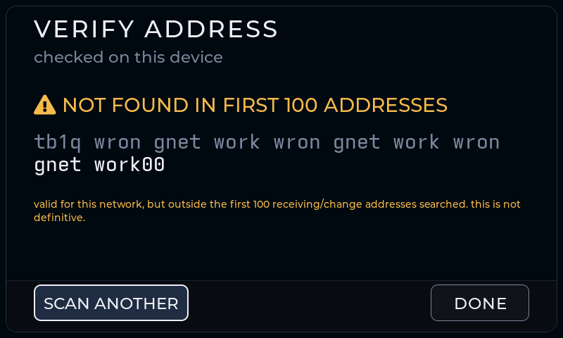

A well-formed address from the wrong network fails red. So does an address that is simply not one of yours.

## Receiving a tiny test payment

Send yourself an amount you would not mind losing, and confirm it arrives, before the wallet holds anything real.

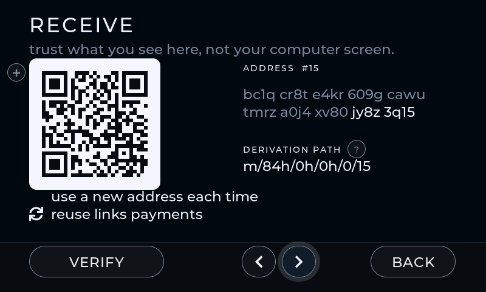

Page to the address you want paying. The counter says which address you are looking at. Tap its QR for a full-screen scan view.

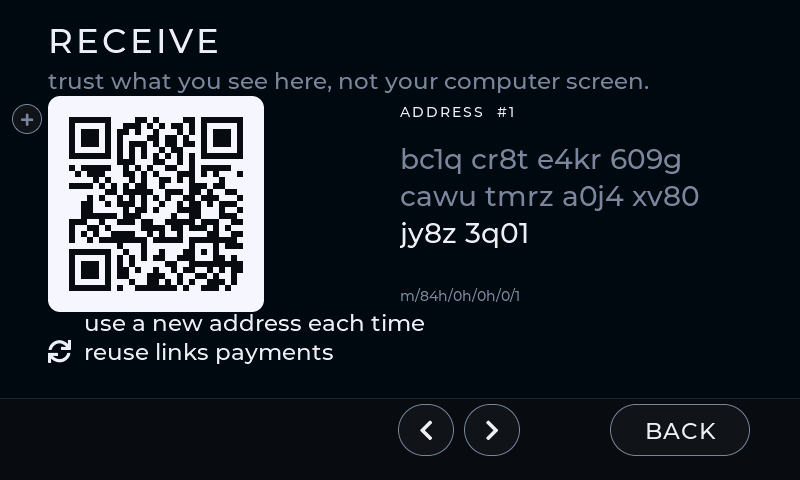

Every address keeps the standing privacy reminder in view: use a new one for each payment, because reuse links payments in public.

## Signing and broadcasting a tiny transaction

Sparrow builds the transaction and Sparrow sends it. KISS only signs, and it is never online to broadcast anything itself.

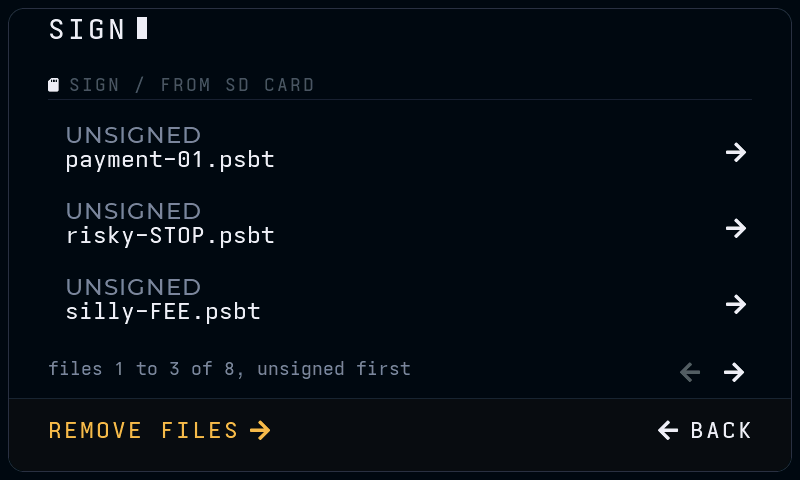

Signing always starts from an unsigned transaction Sparrow made, over SD card or QR. KISS never builds one itself.

What you are actually agreeing to: who gets paid, the network fee, and the total leaving the wallet. Money coming back to you is labelled change only when KISS re-derived that address itself.

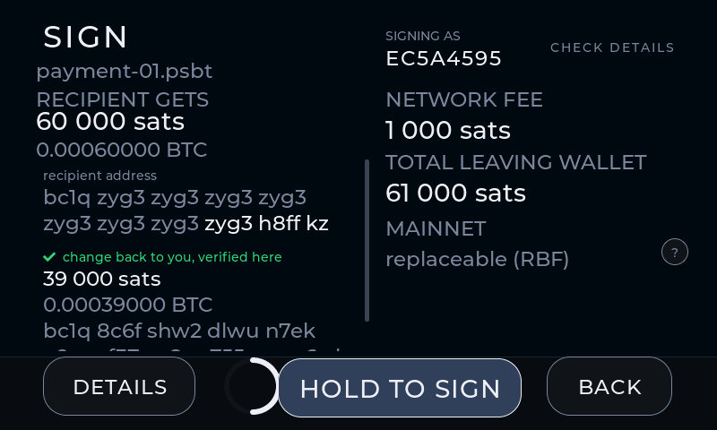

Signing takes a deliberate hold, not a tap, so no single stray touch can ever sign anything.

Signed. The signed file or QR has to go back to Sparrow, and Sparrow broadcasts it. Nothing has been sent yet at this point.

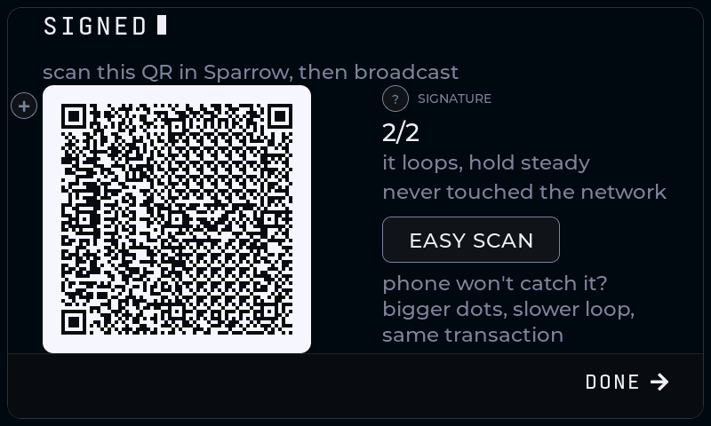

Handing the signature back by animated QR when there is no SD card. Point Sparrow's webcam at it and let it run; tap the QR if the camera needs larger modules.

---

Regenerate with `bash tools/gen_docs_shots.sh`.
