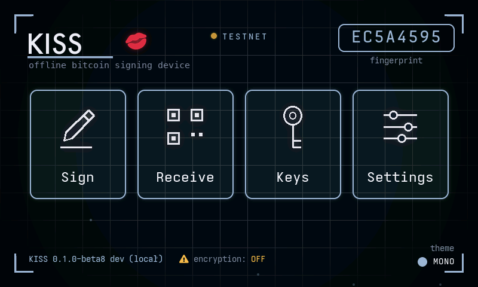
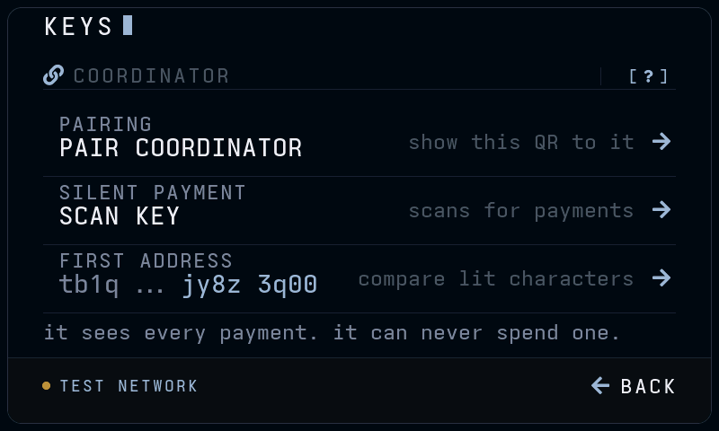
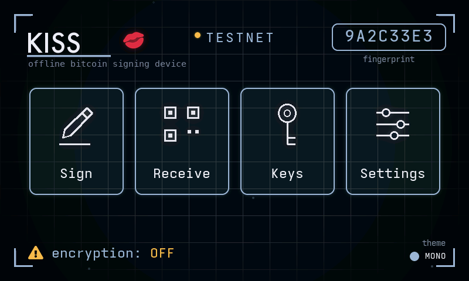
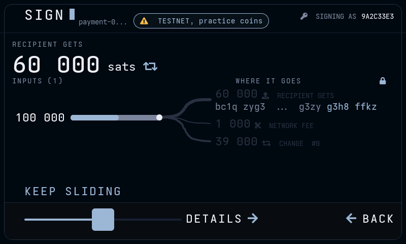
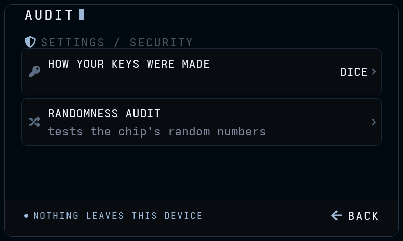
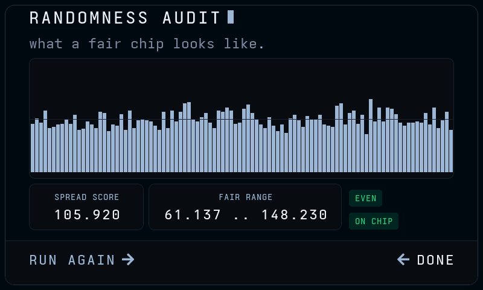

<!-- Generated by tools/gen_docs_shots.py. Do not edit by hand:
     the captions live in that file so they cannot drift from the
     screenshots, and every screenshot is a real simulator frame. -->

# Walkthrough

The checks to make before this signer holds anything you care about. Every screenshot here is a frame the simulator rendered from the current firmware, so what you see is what the device draws.

Three rules first. Everything below assumes them.

1. Every passphrase opens keys. There is no wrong passphrase error, and there never will be.
2. The fingerprint on the home screen is how you tell which keys you opened. Write yours down once.
3. This signer is never online. Your coordinator does all the talking to the network.

## Returning from Fruit Island

The signer has no icon and no launcher. You get back to it by drawing the letters K, I, S, S on the game menu with a fingertip. Nothing on the screen invites you to, and a wrong gesture does nothing at all.

This is everything an onlooker sees: a fruit game. No button for it, no lock icon, no hint that anything else is installed.

Draw K, I, S, S anywhere on the menu. On a signer with no spare set up, that opens the passphrase login. Once a spare exists, the same four letters open that instead, and your own swipe after them is what asks for the passphrase.

Your recovery words and your exact passphrase together make these keys, and the fingerprint here is what those keys are called.

Write it down once, on the same piece of paper as your recovery words: the eight character code on this screen. If the code here ever differs from your paper, you typed the passphrase wrong. Lock and try again.

## Choosing where the recovery words live

Storage is chosen while keys are created or restored, and it can be changed later from an unlocked signer. All three modes are offered on every build; the passphrase, never stored here, is what guards your real keys whichever mode holds the words.

Setup asks what remains after you power off, before the recovery words are committed. FLASH keeps the words on this device (they open the decoy if it is taken); AMNESIC keeps nothing; SD CARD seals the words to a card only this signer can open.

SETTINGS → BACKUP states the current mode on the row and opens this to change it: three modes, each saying where the words end up, with the one in force ticked. Moving between them still requires a deliberate hold and verifies the destination before removing the source.

SETTINGS itself, the page both of those are reached from. Five section groups, one on screen at a time; every row states its current value beside its name, so nothing here has to be opened to be checked.

## Two ways in: the spare signer

A passphrase field on screen is itself a tell. It proves there is something to leave out of it, and you can never show that the passphrase you gave was the last one. So the obvious gesture opens a real, working signer that asks for nothing, and the passphrase lives behind one extra stroke.

Drawing KISS on its own opens a spare signer: the same recovery words with no passphrase. It has its own fingerprint, pairs with a coordinator and signs, because a signer that cannot do those things is not a story anyone would believe.

Put a small amount in it. An empty signer looks exactly like one with something hidden behind it.

One extra swipe after your drawing asks for your passphrase, and the passphrase opens your real signer. You choose which swipe is yours, so reading this firmware tells nobody what to draw.

Draw it over the printed word, twice, before anything is saved. Any other swipe opens the spare, exactly as no swipe does, so a wrong guess looks like a device with nothing behind it.

## Pairing with Sparrow

Pairing hands Sparrow a watch-only map of your keys so it can find your addresses and build transactions. It never hands over anything that can spend.

KEYS is one page about one thing: how a coordinator comes to watch these keys. PAIRING shows it the QR, SCAN KEY hands a silent payments coordinator the key that finds payments without being able to spend them, and FIRST ADDRESS is how you check the pairing landed on the right keys. The [ ? ] mark explains the page.

PAIR COORDINATOR with DESKTOP selected shows the descriptor Sparrow reads. Scan it with Sparrow's webcam, or export to SD. Tap the + beside any QR to enlarge it.

The "?" spells out what the coordinator can and cannot do with what you just handed it.

## Verifying the first receive address

Do this once, before any money moves. It is the step that catches a computer showing you an address that is not yours.

RECEIVE opens on the freshest address KISS derived on the device: its QR, the eight characters to compare, and whether this signer has handed it out before. Read it here, on the device, never off the computer.

VERIFY re-derives whatever address you type in. Green means KISS found it in these keys, independently of whatever displayed it.

A well-formed address from the wrong network fails red. So does an address that is simply not one of yours.

## Practising on testnet first

Testnet coins are free and buy nothing, so the whole loop can be rehearsed with nothing at stake. SETTINGS > SIGNER switches the network, and the same seed words open a separate set of keys there.

The chip beside the title says TESTNET for as long as the signer is on it, and every address it hands out starts tb1. Point your coordinator at the same network, fill it from a testnet faucet, then run the loop you will run for real: verify an address, receive, sign, broadcast. Switch back the same way afterwards and check the chip is gone before anything real arrives.

## Receiving a tiny test payment

Send yourself an amount you would not mind losing, and confirm it arrives, before your keys hold anything real.

NEXT ADDRESS steps to the next one this signer has not handed out. Tap ADDRESS #N to step back through the recent ones, or the QR for a full-screen scan view.

The lamp reads UNUSED until this signer has handed the address out. On one it has, it turns amber and says to take the next: reusing an address links the payments in public.

## Signing and broadcasting a tiny transaction

Sparrow builds the transaction and Sparrow sends it. KISS only signs, and it is never online to broadcast anything itself.

Signing always starts from an unsigned transaction Sparrow made, over SD card or QR. KISS never builds one itself.

What you are actually agreeing to: who gets paid, the network fee, and the total leaving your keys. Money coming back to you is labelled change only when KISS re-derived that address itself.

Signing takes a deliberate slide, not a tap, so no single stray touch can ever sign anything.

Signed. The signed file or QR has to go back to Sparrow, and Sparrow broadcasts it. Nothing has been sent yet at this point.

Handing the signature back by animated QR when there is no SD card. Point Sparrow's webcam at it and let it run; tap the QR if the camera needs larger modules.

## Checking the signer itself

Two questions you can ask this device about its own keys, at any time, with nothing leaving it. SETTINGS > BACKUP > AUDIT, or the same row on SECURITY.

HOW YOUR KEYS WERE MADE reads back the source this signer recorded when the seed was made: dice, coin flips, the camera and your taps, a blind draw, or brought in from somewhere else. It is the one fact about a set of keys you cannot recover by looking at the seed words.

RANDOMNESS AUDIT takes 5000 numbers from the chip and counts them into 100 groups. An even spread inside the fair range is what a working chip looks like; it cannot prove the chip is honest, because good software passes the same test, and the screen says so. A fair chip fails this about 1 run in 500, so run it again before worrying.

---

Regenerate with `bash tools/gen_docs_shots.sh`.
